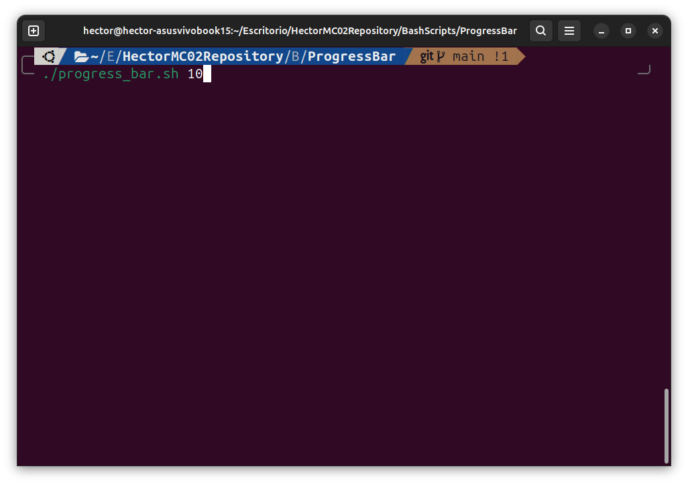

## About

> **[?]**
> This script allows you to set a specific time passed as a parameter for a bar which progresses during that time.

Screenshots

 

|                       How to write the command                        |                           Execution of the script                      |
| :-------------------------------------------------------------------: | :--------------------------------------------------------------------: |
| | |

### Built With

> **[?]**
> This is scripted on Bash lenguage, no dependences

## Getting Started

### Prerequisites

> **[?]**
> To be able to use the power of this simple script you must have another one which needs a progress bar.

### Installation

> **[?]**
> No instalation required

## Usage

> **[?]**
> You must call this script in your own one has a function.
> The usage is, inside your script:

        source progress_bar.sh <amount_of_time>

## Authors & contributors

The original setup of this repository is by [Hector Matanza Cavero](https://github.com/HectorMC02).

